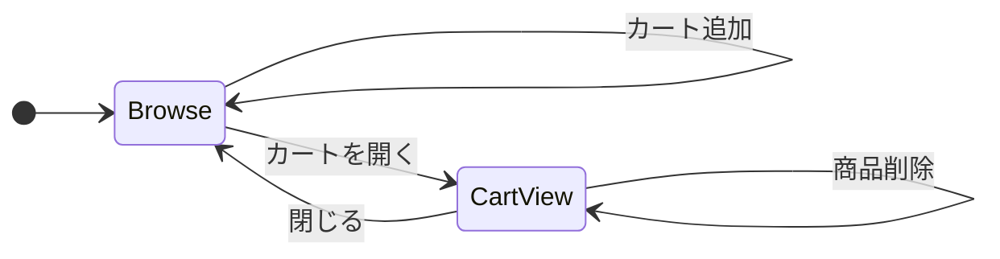
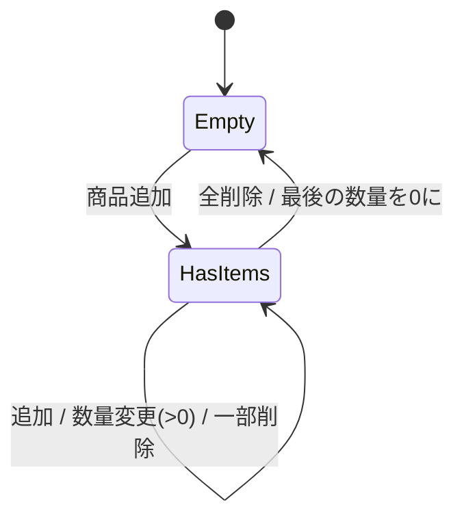

# 09. ショッピングアプリを作ろう(Vanilla TypeScript)

TypeScriptはJavaScriptにトランスコンパイルすることができるので、JS同様にWebアプリを作ることが可能です。

## ゴール

- TypeScript と DOM API だけで、 **動くWebアプリ** を1つ最後まで作りきる
- 自分で書いた state(検索ワード・カート)を、DOMに反映する **再描画のパターン** を体に覚え込ませる
- 「state を変えるたびに DOM を手で同期する」がどれくらい大変か(または楽か)を実感する

研修開始前に **エディタの Copilot / AI 拡張をすべて無効化** してください。

## 題材: シンプル商品検索 + カート

### 機能要件

1. 商品一覧表示(画像URL / 名前 / 価格)
2. 検索ボックスで **リアルタイム** に絞り込み(名前部分一致)
3. 商品カードの「カートに追加」ボタン
4. ヘッダーにカートバッジ(合計点数)
5. カート画面:
   - 商品ごとの数量変更(`+` / `-` / 直接入力)
   - 数量0で自動削除
   - 合計金額表示
6. 「商品一覧」⇄「カート」のビュー切替

## 状態遷移図

### UIモード(画面)



### カートの状態(データ)



### データ構造

```ts
type Product = {
  id: string;
  name: string;
  price: number;
  imageUrl: string;
};

type Cart = Record<string, number>;   // { [productId]: quantity }
// or: type Cart = { productId: string; quantity: number }[];
```

## 制約

- ✅ TypeScript + Vite (`npm create vite@latest -- --template vanilla-ts`)
- ✅ DOM API のみ (`document.querySelector` / `innerHTML` / `addEventListener` 等)
- ✅ CSS は Tailwind CSS v4(導入手順は次節)。ユーティリティクラスで見た目を整える
- ❌ jQuery / Alpine / lit / Web Components ライブラリ
- ❌ UIフレームワーク・状態管理ライブラリ
- ✅ 商品データは `src/products.ts` に静的定義(API連携は今日はやらない)

## 雛形

### 開始手順

```bash
cp -R templates/09-vanilla-shop ~/work/vanilla-shop
cd ~/work/vanilla-shop
npm install
npm run dev
```

### 中身

```
src/
  main.ts          # エントリ
  state.ts         # cart / searchQuery などのアプリ状態を保持
  render.ts        # 「現在の状態 → DOM」を作る関数
  events.ts        # 各種イベントリスナー登録
  products.ts      # 商品データ
  types.ts         # Product, Cart 型
  style.css        # Tailwind を読み込むだけ
index.html
```

### `src/types.ts`

```ts
export type Product = {
  id: string;
  name: string;
  price: number;
  imageUrl: string;
};

// productId → 数量
export type Cart = Record<string, number>;

export type View = "products" | "cart";
```

### `src/products.ts`

```ts
import type { Product } from "./types";

const placeholder = (label: string) =>
  `https://placehold.co/128x128?text=${encodeURIComponent(label)}`;

export const products: Product[] = [
  { id: "p01", name: "クッション",     price: 1200,  imageUrl: placeholder("クッション") },
  { id: "p02", name: "マグカップ",     price: 800,   imageUrl: placeholder("マグカップ") },
  { id: "p03", name: "キーボード",     price: 12000, imageUrl: placeholder("キーボード") },
  { id: "p04", name: "ノート",         price: 350,   imageUrl: placeholder("ノート") },
  { id: "p05", name: "観葉植物",       price: 2500,  imageUrl: placeholder("観葉植物") },
  { id: "p06", name: "ヘッドホン",     price: 8900,  imageUrl: placeholder("ヘッドホン") },
  { id: "p07", name: "文庫本",         price: 980,   imageUrl: placeholder("文庫本") },
  { id: "p08", name: "デスクライト",   price: 4500,  imageUrl: placeholder("デスクライト") },
];
```

### `index.html`

```html
<!doctype html>
<html lang="ja">
  <head>
    <meta charset="UTF-8" />
    <title>Vanilla Shop</title>
  </head>
  <body class="font-sans bg-gray-50 text-gray-900">
    <header class="flex items-center gap-4 px-4 py-2 border-b border-gray-200 bg-white">
      <h1 class="text-xl font-bold shrink-0">Vanilla Shop</h1>
      <input
        id="search-box"
        type="search"
        placeholder="商品を検索"
        class="flex-1 px-3 py-1.5 border border-gray-300 rounded"
      />
      <button id="view-toggle" class="px-3 py-1.5 hover:bg-gray-100 rounded">
        🛒
        <span id="cart-badge" class="inline-block bg-red-500 text-white rounded-full px-1.5 text-xs font-bold align-middle">0</span>
      </button>
    </header>

    <main id="main" class="p-4"><!-- ここに一覧 / カートを描画 --></main>

    <script type="module" src="/src/main.ts"></script>
  </body>
</html>
```

### `src/style.css`
今回cssはフレームワークであるtailwindcssを使用します。
cssを書かずにclassに要素を書くだけでデザインが適用できます。

```css
@import "tailwindcss";
```

### Tailwind className チートシート(描画用)

`render.ts` を実装するときにコピペして使ってください。

| 役割 | 推奨 className |
|---|---|
| 商品一覧のグリッド (root) | `grid grid-cols-[repeat(auto-fill,minmax(180px,1fr))] gap-3` |
| 商品カード | `border border-gray-200 rounded-md p-2 flex flex-col gap-1 bg-white` |
| 商品カード内画像 | `w-32 h-32 mx-auto` |
| 商品カード内ボタン | `mt-auto bg-blue-500 hover:bg-blue-600 text-white px-3 py-1.5 rounded text-sm` |
| 検索結果0件メッセージ | `text-gray-500` |
| カート行 | `flex items-center gap-3 py-2 border-b border-gray-100` |
| カート行の数量入力 | `w-16 px-2 py-1 border border-gray-300 rounded` |
| カート行の削除ボタン | `text-red-500 hover:text-red-700 text-sm` |
| カート合計 | `font-bold mt-4 text-right text-lg` |
| カート空メッセージ | `text-gray-500` |

### `src/state.ts`

```ts
import type { Cart, View } from "./types";

// --- アプリの状態 (モジュールスコープで保持) ---
export let searchQuery = "";
export let cart: Cart = {};
export let currentView: View = "products";

// --- state を更新する関数 (DOM 再描画は呼び出し側の責任) ---

export function setSearchQuery(q: string): void {
  searchQuery = q;
}

export function addToCart(productId: string): void {
  // TODO: cart の productId の数量を +1 する
}

export function setQuantity(productId: string, qty: number): void {
  // TODO: 数量を qty にする。0以下になったらカートから削除する
}

export function removeFromCart(productId: string): void {
  // TODO: cart から productId を削除する
}

export function toggleView(): void {
  // TODO: products ⇔ cart を切り替える
}
```

### `src/render.ts`

```ts
import { products } from "./products";
import { searchQuery, cart, currentView } from "./state";

/**
 * 全体を再描画する。state が変わったら毎回これを呼ぶ。
 */
export function render(): void {
  renderCartBadge();
  const main = document.getElementById("main")!;
  // TODO: currentView に応じて renderProductList か renderCartView を呼び分ける
}

/**
 * 商品一覧を描画する。
 * - searchQuery で products を絞り込む(名前の部分一致)
 * - 各カードに「カートに追加」ボタン
 * - 検索結果0件なら「該当する商品がありません」を出す
 */
function renderProductList(root: HTMLElement): void {
  // TODO
}

/**
 * カート画面を描画する。
 * - cart の各 productId について行を描画
 * - 数量変更 input / 削除ボタン / 合計金額
 * - カートが空なら「カートは空です」を出す
 */
function renderCartView(root: HTMLElement): void {
  // TODO
}

/**
 * ヘッダーのカートバッジ(合計点数)を更新する。
 */
function renderCartBadge(): void {
  // TODO: cart の合計点数を計算して #cart-badge のテキストを更新
}
```

### `src/events.ts`

```ts
import { setSearchQuery, toggleView } from "./state";
import { render } from "./render";

/**
 * すべてのイベントリスナーを登録する。
 * 商品リストやカート画面は再描画で消えるので、
 * **event delegation** (親要素にリスナーを張って data-* で識別)
 * を使うのがおすすめ。
 */
export function registerEvents(): void {
  // 検索ボックス
  const searchBox = document.getElementById("search-box") as HTMLInputElement;
  searchBox.addEventListener("input", (e) => {
    setSearchQuery((e.target as HTMLInputElement).value);
    render();
  });

  // ビュー切替
  document.getElementById("view-toggle")!.addEventListener("click", () => {
    toggleView();
    render();
  });

  // TODO: 商品の「カートに追加」「数量変更」「削除」を処理する
  //       (#main に対する delegation で書くと再描画後も動く)
}
```

### `src/main.ts`

```ts
import "./style.css";
import { registerEvents } from "./events";
import { render } from "./render";

// 初期表示
render();
// イベントリスナー登録
registerEvents();
```

## 動作確認チェックリスト

- [ ] 検索ワードを変えるとリアルタイムで結果が変わる
- [ ] 商品をカートに追加するとヘッダーのバッジ数が増える
- [ ] カート画面に追加した商品が出る
- [ ] 数量を変えると合計が更新される
- [ ] 数量を 0 にすると行が消える
- [ ] 検索結果が0件のとき適切なメッセージが出る

## 任意課題(早く終わったら)

### A. 「カートをすべて空にする」ボタン (易)

- カート画面に「すべて削除」ボタンを追加する
- クリックでカートが空になる
- カートが空のときはボタンを表示しない、または `disabled` にする

### B. 商品カードに「カート内の現在数」を表示 (中)

- 各商品カードに「現在カートに ◯個」のテキストを追加する
- カートに入っていない商品は "0個" または非表示
- カート画面で数量を変えたら、商品一覧側のこの数字も同期する

### C. localStorage でカートを永続化 (中〜難)

- ページをリロードしてもカートの中身が残るようにする
- 起動時に localStorage から読み込んで `cart` を復元する
- state 変更時に `localStorage.setItem("cart", JSON.stringify(cart))` を呼ぶ

### さらに余裕があれば

- ソート(価格順 / 名前順)を検索ボックスの隣に追加
- 検索のデバウンス(300ms)を入れる(`setTimeout` / `clearTimeout` 管理)
- カート画面で `+` `-` ボタンで数量変更
- 「最近見た商品」リスト(商品カードクリックで履歴に追加、最新N件まで)
